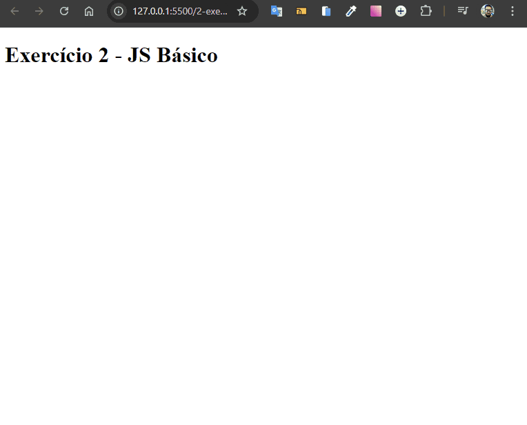

# Validação de Boleto

Desenvolvido como exercício de JavaScript básico do curso de extensão universitária do DevQuest - Dev em Dobro.

O objetivo é criar uma mensagem interativa que realiza a validação de boletos bancários utilizando HTML e JavaScript. A aplicação permite que o usuário responda se pagou ou não o boleto e obtenha a mensagem de confirmação.



## Tecnologias Utilizadas

- **HTML**
- **JavaScript**

## Como Usar

1. Clone este repositório:

   ```bash
   git clone https://github.com/Alberesbass/validacao-de-boleto.git
   ```

2. Abra o arquivo `index.html` em seu navegador para acessar a aplicação de validação de boletos.

## Licença

Este projeto está sob a licença MIT. Consulte o arquivo [LICENSE](./LICENSE) para mais informações.

---

Desenvolvido por [Alberes](https://github.com/Alberesbass)